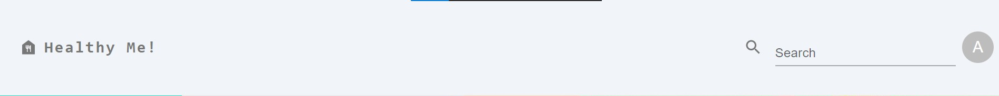
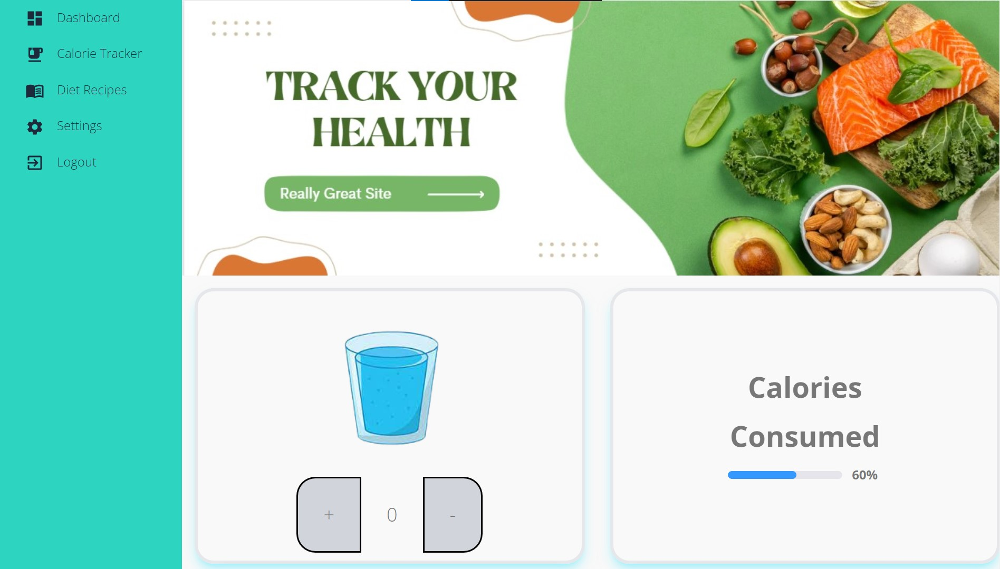
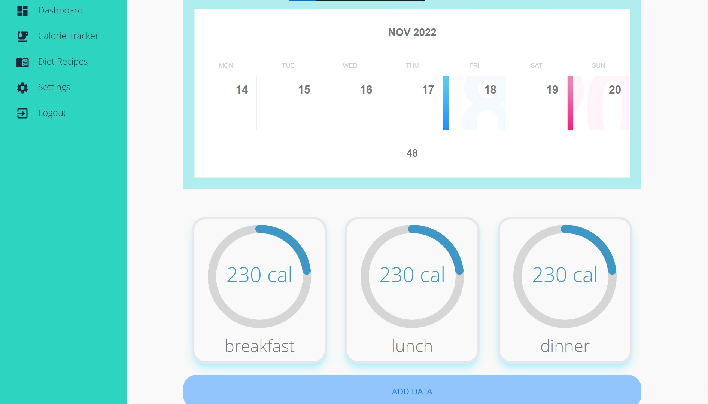
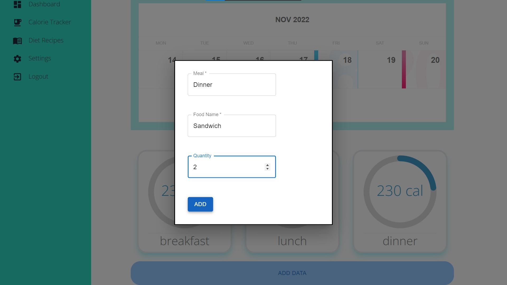
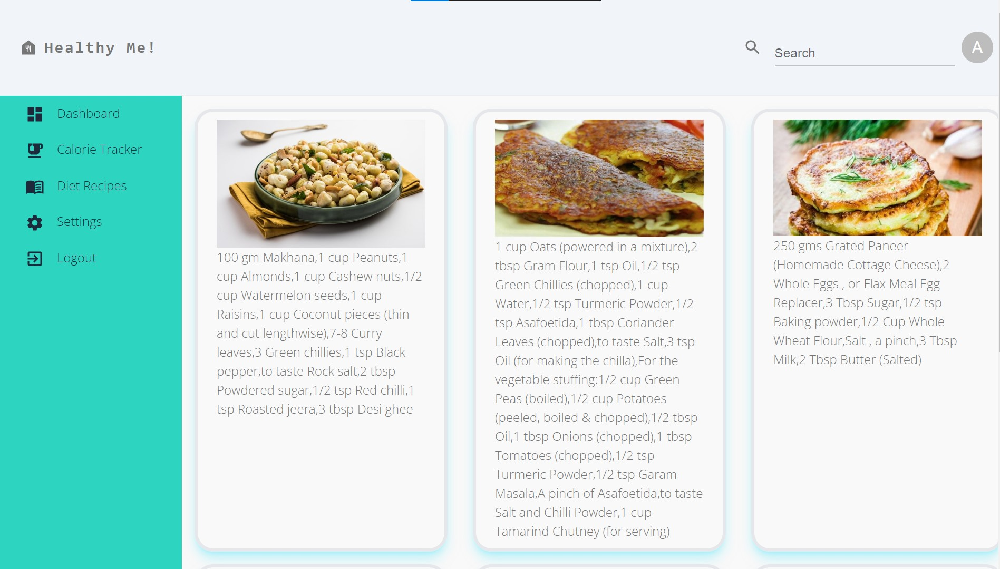
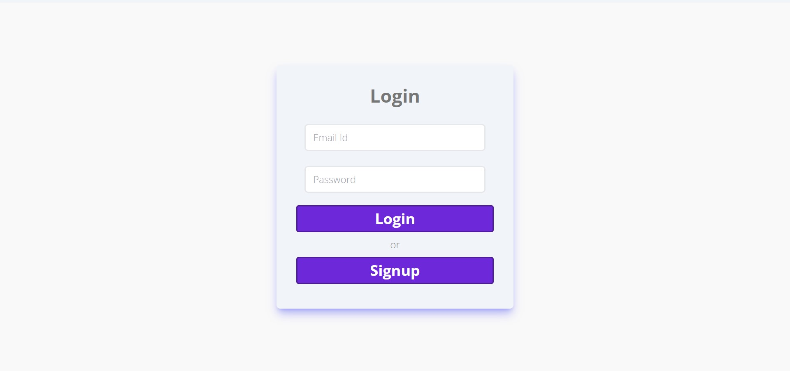
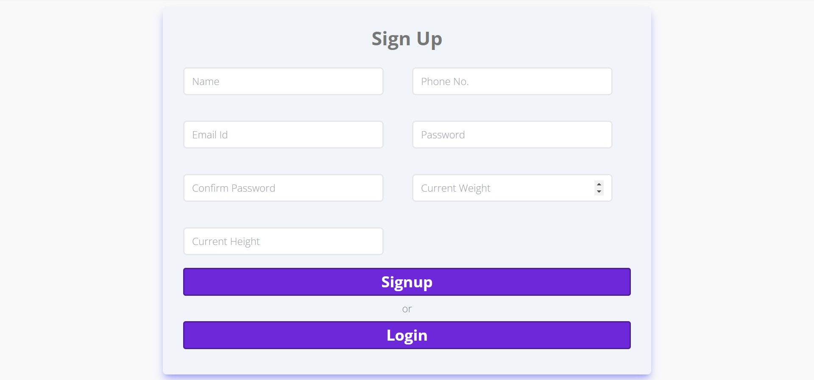

# Health Me!

## Background
### Now-a-days there is a heightened awareness regarding the maintenance of the physical well being of people. Due to this, there is a lot of scope to build solutions with the help of technology and help people maintain a sound body and mind. The application built would help to keep track of the nutritive intake of food for a person. This application will be responsible for helping people maintain their dietary chart. It will act as a reminder for the person to do the most basic things(e.g.Drinking water) that are necessary but often forgotten.

## Features

1. Incorporate a calorie tracker that will keep a track of the user’s intake of nutrients.
2. Provide information regarding the estimated portion size
of a particular item(vegetables, roti,etc.)

## Screenshots

1. Dashboard

2. Calorie Tracker

3. Diet Recipes

4. Login - Signup

